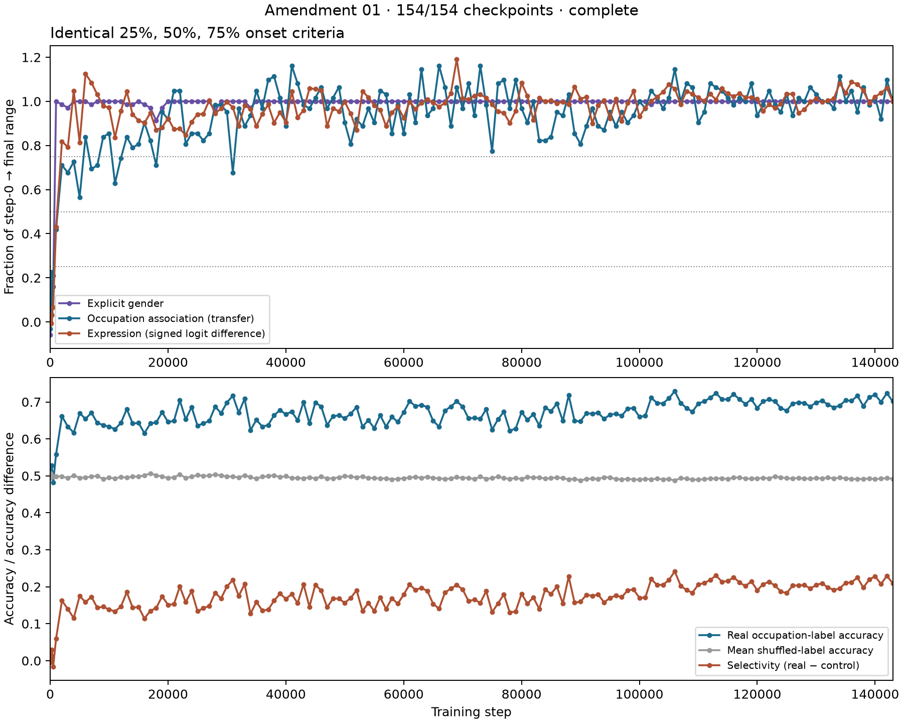

# Shared onset criteria and selectivity

**complete: 154/154 checkpoints.**

Post-inspection amendment; original protocol and results retained. Crossing brackets are point estimates; interpret their ordering alongside bootstrap uncertainty and checkpoint resolution.

| Range crossed | Explicit gender | Association (transfer) | Expression | Ordering |
|---:|---|---|---|---|
| 25% | [512, 1000] | [512, 1000] | [512, 1000] | overlapping_brackets |
| 50% | [512, 1000] | [1000, 2000] | [1000, 2000] | overlapping_brackets |
| 75% | [512, 1000] | [5000, 6000] | [1000, 2000] | expression_before_association |

Brackets are first observed crossings, not confidence intervals. Do not interpolate missing checkpoints. Endpoint uncertainty is propagated in the bootstrap; see JSON for valid-denominator fractions, pointwise intervals, paired onset differences, and identical sustained-crossing sensitivity.

| Step | Real occupation probe | Mean control | Selectivity (pp) | 95% interval (pp) |
|---:|---:|---:|---:|---|
| 0 | 0.524 | 0.497 | 2.67 | [-1.91, 6.86] |
| 1 | 0.524 | 0.497 | 2.67 | [-1.91, 6.86] |
| 2 | 0.524 | 0.497 | 2.67 | [-1.89, 6.85] |
| 4 | 0.524 | 0.497 | 2.66 | [-1.90, 6.77] |
| 8 | 0.518 | 0.496 | 2.20 | [-2.22, 6.54] |
| 16 | 0.501 | 0.495 | 0.65 | [-6.07, 6.92] |
| 32 | 0.508 | 0.498 | 0.99 | [-5.35, 7.07] |
| 64 | 0.503 | 0.507 | -0.39 | [-6.26, 5.34] |
| 128 | 0.511 | 0.497 | 1.42 | [-3.90, 6.72] |
| 256 | 0.528 | 0.497 | 3.03 | [-0.85, 6.96] |
| 512 | 0.482 | 0.498 | -1.58 | [-6.14, 2.83] |
| 1000 | 0.558 | 0.499 | 5.95 | [0.44, 11.24] |
| 2000 | 0.661 | 0.499 | 16.24 | [8.37, 23.70] |
| 3000 | 0.633 | 0.494 | 13.96 | [6.19, 21.27] |
| 4000 | 0.617 | 0.501 | 11.53 | [4.13, 17.93] |
| 5000 | 0.669 | 0.495 | 17.47 | [9.06, 25.41] |
| 6000 | 0.654 | 0.496 | 15.85 | [7.81, 23.32] |
| 7000 | 0.671 | 0.498 | 17.27 | [9.57, 24.35] |
| 8000 | 0.643 | 0.500 | 14.32 | [6.28, 22.08] |
| 9000 | 0.637 | 0.492 | 14.59 | [8.63, 20.34] |
| 10000 | 0.633 | 0.495 | 13.84 | [8.59, 19.21] |
| 11000 | 0.626 | 0.493 | 13.33 | [6.72, 19.60] |
| 12000 | 0.643 | 0.497 | 14.61 | [8.69, 20.40] |
| 13000 | 0.681 | 0.495 | 18.53 | [10.53, 25.47] |
| 14000 | 0.642 | 0.498 | 14.37 | [5.87, 22.19] |
| 15000 | 0.643 | 0.498 | 14.49 | [7.25, 21.57] |
| 16000 | 0.615 | 0.501 | 11.42 | [4.55, 17.82] |
| 17000 | 0.642 | 0.507 | 13.49 | [5.33, 20.67] |
| 18000 | 0.644 | 0.502 | 14.28 | [5.61, 22.05] |
| 19000 | 0.672 | 0.498 | 17.40 | [10.63, 23.47] |
| 20000 | 0.646 | 0.495 | 15.12 | [6.58, 23.08] |
| 21000 | 0.649 | 0.496 | 15.27 | [6.51, 22.91] |
| 22000 | 0.704 | 0.504 | 20.04 | [10.93, 28.20] |
| 23000 | 0.653 | 0.495 | 15.83 | [6.76, 24.45] |
| 24000 | 0.686 | 0.498 | 18.83 | [11.30, 25.98] |
| 25000 | 0.636 | 0.502 | 13.40 | [5.36, 20.98] |
| 26000 | 0.642 | 0.500 | 14.18 | [6.66, 21.24] |
| 27000 | 0.649 | 0.500 | 14.81 | [8.36, 20.65] |
| 28000 | 0.688 | 0.504 | 18.38 | [10.44, 25.31] |
| 29000 | 0.669 | 0.501 | 16.83 | [8.56, 24.32] |
| 30000 | 0.699 | 0.498 | 20.09 | [9.76, 29.36] |
| 31000 | 0.717 | 0.498 | 21.82 | [12.96, 29.53] |
| 32000 | 0.671 | 0.496 | 17.51 | [9.29, 25.20] |
| 33000 | 0.708 | 0.501 | 20.72 | [12.36, 28.24] |
| 34000 | 0.624 | 0.497 | 12.69 | [4.58, 20.27] |
| 35000 | 0.651 | 0.492 | 15.92 | [8.80, 22.42] |
| 36000 | 0.633 | 0.498 | 13.56 | [5.33, 20.64] |
| 37000 | 0.637 | 0.499 | 13.83 | [6.28, 20.92] |
| 38000 | 0.664 | 0.502 | 16.22 | [8.56, 22.95] |
| 39000 | 0.678 | 0.497 | 18.12 | [9.63, 25.91] |
| 40000 | 0.667 | 0.499 | 16.74 | [8.71, 24.37] |
| 41000 | 0.674 | 0.494 | 18.00 | [9.58, 25.73] |
| 42000 | 0.650 | 0.494 | 15.58 | [7.76, 23.03] |
| 43000 | 0.700 | 0.493 | 20.69 | [12.26, 28.17] |
| 44000 | 0.642 | 0.496 | 14.57 | [7.07, 21.61] |
| 45000 | 0.699 | 0.493 | 20.56 | [11.92, 28.53] |
| 46000 | 0.688 | 0.498 | 18.96 | [9.93, 26.98] |
| 47000 | 0.637 | 0.493 | 14.46 | [5.86, 22.60] |
| 48000 | 0.661 | 0.493 | 16.76 | [7.82, 24.90] |
| 49000 | 0.664 | 0.496 | 16.77 | [7.63, 25.42] |
| 50000 | 0.656 | 0.499 | 15.65 | [7.24, 23.43] |
| 51000 | 0.668 | 0.498 | 16.98 | [8.46, 24.80] |
| 52000 | 0.686 | 0.496 | 19.04 | [10.32, 27.08] |
| 53000 | 0.633 | 0.499 | 13.47 | [6.13, 20.42] |
| 54000 | 0.650 | 0.494 | 15.60 | [7.58, 23.17] |
| 55000 | 0.629 | 0.495 | 13.45 | [7.61, 19.35] |
| 56000 | 0.664 | 0.492 | 17.15 | [9.23, 24.66] |
| 57000 | 0.633 | 0.493 | 13.99 | [7.60, 20.31] |
| 58000 | 0.660 | 0.491 | 16.89 | [8.20, 25.03] |
| 59000 | 0.646 | 0.492 | 15.40 | [8.38, 22.50] |
| 60000 | 0.672 | 0.493 | 17.89 | [9.96, 25.44] |
| 61000 | 0.701 | 0.495 | 20.60 | [12.51, 28.15] |
| 62000 | 0.689 | 0.497 | 19.16 | [11.27, 26.44] |
| 63000 | 0.692 | 0.495 | 19.69 | [12.37, 26.83] |
| 64000 | 0.686 | 0.497 | 18.89 | [10.91, 26.31] |
| 65000 | 0.649 | 0.495 | 15.37 | [9.23, 21.55] |
| 66000 | 0.633 | 0.493 | 14.06 | [6.46, 20.83] |
| 67000 | 0.676 | 0.492 | 18.44 | [10.83, 25.66] |
| 68000 | 0.688 | 0.492 | 19.50 | [11.52, 26.23] |
| 69000 | 0.701 | 0.497 | 20.49 | [12.62, 27.83] |
| 70000 | 0.688 | 0.495 | 19.30 | [10.80, 26.62] |
| 71000 | 0.656 | 0.494 | 16.11 | [8.20, 23.61] |
| 72000 | 0.657 | 0.492 | 16.53 | [9.26, 23.28] |
| 73000 | 0.654 | 0.498 | 15.65 | [8.80, 22.39] |
| 74000 | 0.681 | 0.492 | 18.84 | [8.85, 27.63] |
| 75000 | 0.625 | 0.494 | 13.12 | [4.16, 21.68] |
| 76000 | 0.653 | 0.498 | 15.49 | [7.26, 23.35] |
| 77000 | 0.674 | 0.494 | 17.96 | [8.74, 25.88] |
| 78000 | 0.622 | 0.492 | 13.03 | [4.85, 20.83] |
| 79000 | 0.628 | 0.494 | 13.35 | [6.69, 19.94] |
| 80000 | 0.672 | 0.491 | 18.10 | [9.29, 25.99] |
| 81000 | 0.651 | 0.497 | 15.40 | [8.25, 21.79] |
| 82000 | 0.667 | 0.495 | 17.12 | [9.23, 24.21] |
| 83000 | 0.636 | 0.496 | 14.02 | [6.94, 20.90] |
| 84000 | 0.685 | 0.492 | 19.22 | [11.69, 26.40] |
| 85000 | 0.675 | 0.494 | 18.07 | [10.13, 25.65] |
| 86000 | 0.696 | 0.496 | 20.03 | [11.82, 27.54] |
| 87000 | 0.649 | 0.494 | 15.47 | [8.41, 22.01] |
| 88000 | 0.718 | 0.491 | 22.75 | [13.83, 31.05] |
| 89000 | 0.649 | 0.492 | 15.68 | [7.99, 23.44] |
| 90000 | 0.647 | 0.488 | 15.97 | [8.05, 23.00] |
| 91000 | 0.669 | 0.491 | 17.80 | [9.15, 25.56] |
| 92000 | 0.668 | 0.492 | 17.56 | [9.04, 25.35] |
| 93000 | 0.671 | 0.492 | 17.90 | [9.22, 26.01] |
| 94000 | 0.654 | 0.496 | 15.79 | [8.45, 22.81] |
| 95000 | 0.665 | 0.496 | 16.95 | [8.78, 24.44] |
| 96000 | 0.668 | 0.492 | 17.65 | [9.15, 25.31] |
| 97000 | 0.662 | 0.491 | 17.19 | [8.42, 25.03] |
| 98000 | 0.682 | 0.492 | 19.02 | [10.36, 27.06] |
| 99000 | 0.683 | 0.490 | 19.28 | [11.00, 26.80] |
| 100000 | 0.660 | 0.490 | 17.01 | [8.09, 24.85] |
| 101000 | 0.662 | 0.492 | 17.06 | [8.20, 25.13] |
| 102000 | 0.711 | 0.490 | 22.06 | [13.12, 29.85] |
| 103000 | 0.697 | 0.492 | 20.49 | [12.24, 27.94] |
| 104000 | 0.696 | 0.490 | 20.53 | [12.03, 28.36] |
| 105000 | 0.710 | 0.492 | 21.81 | [13.83, 29.11] |
| 106000 | 0.729 | 0.487 | 24.17 | [16.20, 31.44] |
| 107000 | 0.697 | 0.494 | 20.28 | [12.48, 27.40] |
| 108000 | 0.683 | 0.492 | 19.10 | [11.26, 26.07] |
| 109000 | 0.674 | 0.490 | 18.38 | [10.35, 25.85] |
| 110000 | 0.696 | 0.490 | 20.62 | [12.26, 28.12] |
| 111000 | 0.701 | 0.491 | 21.00 | [12.70, 28.11] |
| 112000 | 0.711 | 0.493 | 21.84 | [13.21, 29.54] |
| 113000 | 0.724 | 0.493 | 23.06 | [14.57, 30.36] |
| 114000 | 0.707 | 0.493 | 21.36 | [12.67, 28.92] |
| 115000 | 0.707 | 0.492 | 21.53 | [11.84, 29.79] |
| 116000 | 0.721 | 0.495 | 22.58 | [14.36, 29.85] |
| 117000 | 0.707 | 0.496 | 21.12 | [12.35, 28.79] |
| 118000 | 0.694 | 0.492 | 20.19 | [11.69, 28.06] |
| 119000 | 0.707 | 0.492 | 21.46 | [12.78, 29.10] |
| 120000 | 0.683 | 0.493 | 19.05 | [10.01, 26.81] |
| 121000 | 0.701 | 0.494 | 20.69 | [11.62, 28.72] |
| 122000 | 0.707 | 0.493 | 21.35 | [12.22, 29.44] |
| 123000 | 0.701 | 0.498 | 20.32 | [11.99, 27.83] |
| 124000 | 0.683 | 0.496 | 18.75 | [11.08, 25.95] |
| 125000 | 0.676 | 0.494 | 18.26 | [10.09, 25.58] |
| 126000 | 0.696 | 0.493 | 20.31 | [11.77, 27.79] |
| 127000 | 0.699 | 0.495 | 20.39 | [11.55, 28.33] |
| 128000 | 0.697 | 0.493 | 20.47 | [11.78, 28.47] |
| 129000 | 0.688 | 0.492 | 19.51 | [10.44, 27.87] |
| 130000 | 0.699 | 0.494 | 20.48 | [12.00, 28.16] |
| 131000 | 0.703 | 0.493 | 20.96 | [12.29, 28.88] |
| 132000 | 0.693 | 0.495 | 19.78 | [11.69, 27.26] |
| 133000 | 0.685 | 0.493 | 19.17 | [10.99, 26.90] |
| 134000 | 0.690 | 0.495 | 19.53 | [11.64, 26.53] |
| 135000 | 0.704 | 0.493 | 21.08 | [13.17, 28.19] |
| 136000 | 0.703 | 0.491 | 21.17 | [13.02, 28.49] |
| 137000 | 0.717 | 0.492 | 22.50 | [13.97, 30.16] |
| 138000 | 0.689 | 0.491 | 19.76 | [11.59, 27.10] |
| 139000 | 0.713 | 0.493 | 21.95 | [14.03, 29.12] |
| 140000 | 0.719 | 0.491 | 22.83 | [14.90, 30.04] |
| 141000 | 0.700 | 0.493 | 20.74 | [12.60, 28.22] |
| 142000 | 0.724 | 0.494 | 22.97 | [14.52, 30.42] |
| 143000 | 0.701 | 0.492 | 20.92 | [12.78, 28.10] |

Shuffled controls preserve each fold's class balance and occupation labels across templates. They test arbitrary-label decoding capacity, not all structured semantic confounds. All uncertainty conditions on fitted probes.

An earlier expression crossing is compatible with nonlinear/distributed encoding but does not establish it. Robustness across thresholds is not causal proof. See [interpretation commitments](../AMENDMENT-01.md).
