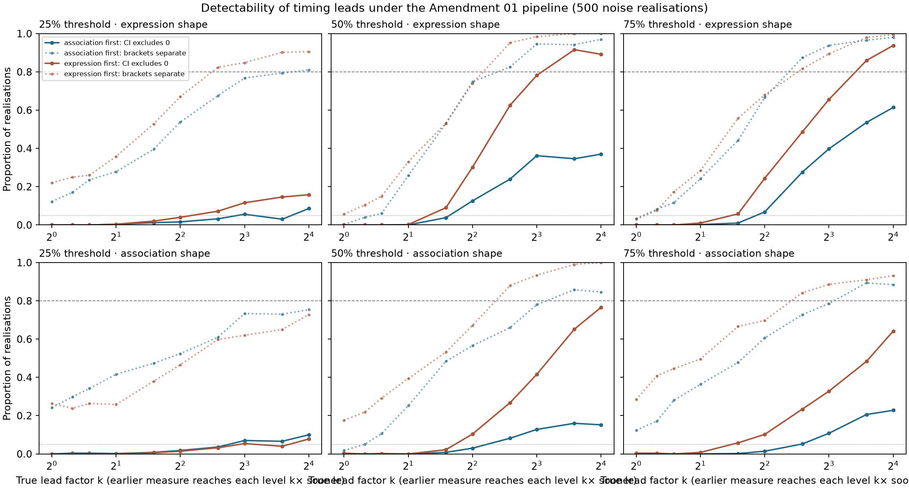

# Detectability of timing leads (exploratory, post hoc)

**Question:** if one measure truly led the other, would the Amendment 01 pipeline have detected it?

This analysis was run on 2026-09-28, after all results were known. It is a power analysis of the existing design. It does not re-test the hypothesis.

## Method

- Each measure's per-occupation curves are smoothed with a local-linear smoother in log(1+step); the bandwidth is chosen by leave-one-out CV.
- Leverage-corrected residuals are split into a checkpoint-wide shock (shared by all occupations) and an item part.
- Both synthetic measures share one true shape (the smoothed expression curve; the association curve as a sensitivity check), each with its own per-occupation floor and amplitude.
- A lead is created by time rescaling: the earlier measure reaches every level k× sooner. Step 0 stays at the initialisation floor.
- New noise realisations re-sign the real residuals (Rademacher), using the same signs for both measures at each checkpoint and occupation.
- The unchanged amendment pipeline is then applied: endpoint normalisation, first-crossing brackets, and a paired stratified occupation bootstrap with the same 2,000 draws.
- Realisations per condition: 500.

Calibration check: at k = 1, the simulated median bootstrap CI widths are comparable to those observed in the real study (see JSON).

## Summary

- **Expression shape as the truth.** The highest power to resolve an association-first lead with the paired CI is 61% (k = 16, 75% threshold). For an expression-first lead it is 94% (k = 16, 75%). Under no lead, the CI excludes zero in at most 0% of realisations, while the bracket rule reports a spurious ordering in up to 22%.
- **Association shape as the truth.** The highest power to resolve an association-first lead with the paired CI is 23% (k = 16, 75% threshold). For an expression-first lead it is 77% (k = 16, 50%). Under no lead, the CI excludes zero in at most 0% of realisations, while the bracket rule reports a spurious ordering in up to 28%.
- The v1 design is therefore poorly powered to detect a representation-first lead of any size tested (up to 16× on log-time). Its overlapping-bracket result should be read as *not informative about moderate leads*, not as evidence of co-emergence.
- On Pythia's checkpoint grid, the largest resolvable lead at a threshold is bounded by the later measure's crossing time. Expression crosses 25% near step 660, and there is no checkpoint between 512 and 1,000.
- The point-estimate bracket ordering is not a controlled test. Only bootstrap-based comparisons should carry an ordering claim.
- Power is asymmetric because the association curve (accuracy of six templates per occupation) is noisier relative to its range than the expression curve.
- Positive control: explicit-gender decoding visibly precedes expression, and the 75% bootstrap CI excludes zero. The bracket rule still reports overlap at every threshold, because adjacent brackets share an endpoint.

## Power with the expression shape as the truth

| k | Threshold | True lead (steps) | P(CI excludes 0, correct direction) | P(brackets separate, correct direction) | P(brackets separate, wrong direction) | Median CI width |
|---:|---:|---:|---:|---:|---:|---:|
| 1 (null) | 25% | 0 | 0.00 (false positive, either direction) | 0.12 (assoc) | 0.22 (expr) | 2416 |
| 1 (null) | 50% | 0 | 0.00 (false positive, either direction) | 0.00 (assoc) | 0.06 (expr) | 2936 |
| 1 (null) | 75% | 0 | 0.00 (false positive, either direction) | 0.03 (assoc) | 0.03 (expr) | 3000 |
| 1.25 (association first) | 25% | 132 | 0.00 | 0.17 | 0.20 | 1992 |
| 1.25 (association first) | 50% | 244 | 0.00 | 0.04 | 0.04 | 2936 |
| 1.25 (association first) | 75% | 461 | 0.00 | 0.08 | 0.01 | 3000 |
| 1.5 (association first) | 25% | 220 | 0.00 | 0.24 | 0.21 | 1960 |
| 1.5 (association first) | 50% | 407 | 0.00 | 0.06 | 0.05 | 2488 |
| 1.5 (association first) | 75% | 768 | 0.00 | 0.12 | 0.00 | 3000 |
| 2 (association first) | 25% | 330 | 0.00 | 0.28 | 0.21 | 1984 |
| 2 (association first) | 50% | 610 | 0.00 | 0.26 | 0.02 | 2424 |
| 2 (association first) | 75% | 1152 | 0.00 | 0.24 | 0.00 | 3000 |
| 3 (association first) | 25% | 440 | 0.01 | 0.40 | 0.20 | 1936 |
| 3 (association first) | 50% | 813 | 0.04 | 0.53 | 0.04 | 2424 |
| 3 (association first) | 75% | 1537 | 0.01 | 0.44 | 0.00 | 3000 |
| 4 (association first) | 25% | 495 | 0.02 | 0.54 | 0.15 | 1936 |
| 4 (association first) | 50% | 915 | 0.13 | 0.75 | 0.04 | 2064 |
| 4 (association first) | 75% | 1729 | 0.07 | 0.67 | 0.00 | 3424 |
| 6 (association first) | 25% | 550 | 0.03 | 0.68 | 0.07 | 1936 |
| 6 (association first) | 50% | 1017 | 0.24 | 0.83 | 0.04 | 2064 |
| 6 (association first) | 75% | 1921 | 0.28 | 0.87 | 0.00 | 3192 |
| 8 (association first) | 25% | 578 | 0.06 | 0.77 | 0.02 | 1936 |
| 8 (association first) | 50% | 1068 | 0.36 | 0.95 | 0.01 | 2000 |
| 8 (association first) | 75% | 2017 | 0.40 | 0.94 | 0.00 | 2936 |
| 12 (association first) | 25% | 605 | 0.03 | 0.79 | 0.01 | 1936 |
| 12 (association first) | 50% | 1118 | 0.35 | 0.94 | 0.01 | 2000 |
| 12 (association first) | 75% | 2113 | 0.54 | 0.97 | 0.00 | 2941 |
| 16 (association first) | 25% | 619 | 0.09 | 0.81 | 0.01 | 1936 |
| 16 (association first) | 50% | 1144 | 0.37 | 0.97 | 0.00 | 1968 |
| 16 (association first) | 75% | 2161 | 0.61 | 0.98 | 0.00 | 2936 |
| 1.25 (expression first) | 25% | 132 | 0.00 | 0.25 | 0.11 | 1992 |
| 1.25 (expression first) | 50% | 244 | 0.00 | 0.10 | 0.00 | 2448 |
| 1.25 (expression first) | 75% | 461 | 0.00 | 0.08 | 0.01 | 3000 |
| 1.5 (expression first) | 25% | 220 | 0.00 | 0.26 | 0.10 | 1968 |
| 1.5 (expression first) | 50% | 407 | 0.00 | 0.15 | 0.00 | 1997 |
| 1.5 (expression first) | 75% | 768 | 0.00 | 0.17 | 0.00 | 2938 |
| 2 (expression first) | 25% | 330 | 0.00 | 0.36 | 0.06 | 1976 |
| 2 (expression first) | 50% | 610 | 0.00 | 0.33 | 0.00 | 1976 |
| 2 (expression first) | 75% | 1152 | 0.01 | 0.28 | 0.00 | 2936 |
| 3 (expression first) | 25% | 440 | 0.02 | 0.53 | 0.05 | 1936 |
| 3 (expression first) | 50% | 813 | 0.09 | 0.53 | 0.00 | 1936 |
| 3 (expression first) | 75% | 1537 | 0.06 | 0.56 | 0.00 | 2996 |
| 4 (expression first) | 25% | 495 | 0.04 | 0.67 | 0.05 | 1936 |
| 4 (expression first) | 50% | 915 | 0.30 | 0.74 | 0.00 | 1936 |
| 4 (expression first) | 75% | 1729 | 0.24 | 0.68 | 0.00 | 2936 |
| 6 (expression first) | 25% | 550 | 0.07 | 0.82 | 0.06 | 1928 |
| 6 (expression first) | 50% | 1017 | 0.63 | 0.95 | 0.00 | 1936 |
| 6 (expression first) | 75% | 1921 | 0.49 | 0.82 | 0.00 | 2936 |
| 8 (expression first) | 25% | 578 | 0.12 | 0.85 | 0.05 | 1880 |
| 8 (expression first) | 50% | 1068 | 0.78 | 0.98 | 0.00 | 1744 |
| 8 (expression first) | 75% | 2017 | 0.66 | 0.89 | 0.00 | 2936 |
| 12 (expression first) | 25% | 605 | 0.15 | 0.90 | 0.03 | 1873 |
| 12 (expression first) | 50% | 1118 | 0.92 | 1.00 | 0.00 | 1680 |
| 12 (expression first) | 75% | 2113 | 0.86 | 0.98 | 0.00 | 2448 |
| 16 (expression first) | 25% | 619 | 0.16 | 0.91 | 0.05 | 1892 |
| 16 (expression first) | 50% | 1144 | 0.89 | 1.00 | 0.00 | 1744 |
| 16 (expression first) | 75% | 2161 | 0.94 | 0.99 | 0.00 | 2192 |

## Power with the association shape as the truth

| k | Threshold | True lead (steps) | P(CI excludes 0, correct direction) | P(brackets separate, correct direction) | P(brackets separate, wrong direction) | Median CI width |
|---:|---:|---:|---:|---:|---:|---:|
| 1 (null) | 25% | 0 | 0.00 (false positive, either direction) | 0.24 (assoc) | 0.26 (expr) | 1912 |
| 1 (null) | 50% | 0 | 0.00 (false positive, either direction) | 0.02 (assoc) | 0.18 (expr) | 3424 |
| 1 (null) | 75% | 0 | 0.00 (false positive, either direction) | 0.12 (assoc) | 0.28 (expr) | 8000 |
| 1.25 (association first) | 25% | 109 | 0.00 | 0.30 | 0.19 | 1872 |
| 1.25 (association first) | 50% | 265 | 0.00 | 0.05 | 0.15 | 3232 |
| 1.25 (association first) | 75% | 1648 | 0.00 | 0.17 | 0.19 | 7936 |
| 1.5 (association first) | 25% | 182 | 0.00 | 0.34 | 0.19 | 1728 |
| 1.5 (association first) | 50% | 442 | 0.00 | 0.11 | 0.12 | 3424 |
| 1.5 (association first) | 75% | 2747 | 0.00 | 0.28 | 0.14 | 7936 |
| 2 (association first) | 25% | 272 | 0.00 | 0.42 | 0.18 | 1431 |
| 2 (association first) | 50% | 662 | 0.00 | 0.25 | 0.11 | 2976 |
| 2 (association first) | 75% | 4120 | 0.00 | 0.36 | 0.08 | 7000 |
| 3 (association first) | 25% | 363 | 0.01 | 0.47 | 0.18 | 1244 |
| 3 (association first) | 50% | 883 | 0.01 | 0.48 | 0.12 | 2744 |
| 3 (association first) | 75% | 5493 | 0.00 | 0.48 | 0.04 | 6424 |
| 4 (association first) | 25% | 409 | 0.02 | 0.52 | 0.13 | 1176 |
| 4 (association first) | 50% | 994 | 0.03 | 0.57 | 0.13 | 2680 |
| 4 (association first) | 75% | 6180 | 0.01 | 0.61 | 0.02 | 6424 |
| 6 (association first) | 25% | 454 | 0.04 | 0.61 | 0.07 | 1058 |
| 6 (association first) | 50% | 1104 | 0.08 | 0.66 | 0.13 | 2432 |
| 6 (association first) | 75% | 6867 | 0.05 | 0.73 | 0.01 | 5744 |
| 8 (association first) | 25% | 477 | 0.07 | 0.73 | 0.01 | 1048 |
| 8 (association first) | 50% | 1159 | 0.13 | 0.78 | 0.08 | 2432 |
| 8 (association first) | 75% | 7210 | 0.11 | 0.79 | 0.01 | 5744 |
| 12 (association first) | 25% | 500 | 0.07 | 0.73 | 0.02 | 1040 |
| 12 (association first) | 50% | 1215 | 0.16 | 0.86 | 0.03 | 2186 |
| 12 (association first) | 75% | 7553 | 0.21 | 0.89 | 0.02 | 5840 |
| 16 (association first) | 25% | 511 | 0.10 | 0.75 | 0.01 | 1008 |
| 16 (association first) | 50% | 1242 | 0.15 | 0.85 | 0.01 | 2168 |
| 16 (association first) | 75% | 7725 | 0.23 | 0.88 | 0.02 | 5744 |
| 1.25 (expression first) | 25% | 109 | 0.00 | 0.24 | 0.28 | 1808 |
| 1.25 (expression first) | 50% | 265 | 0.00 | 0.22 | 0.01 | 2936 |
| 1.25 (expression first) | 75% | 1648 | 0.00 | 0.41 | 0.05 | 7936 |
| 1.5 (expression first) | 25% | 182 | 0.00 | 0.26 | 0.22 | 1488 |
| 1.5 (expression first) | 50% | 442 | 0.00 | 0.29 | 0.00 | 2936 |
| 1.5 (expression first) | 75% | 2747 | 0.00 | 0.45 | 0.05 | 7000 |
| 2 (expression first) | 25% | 272 | 0.00 | 0.26 | 0.21 | 1416 |
| 2 (expression first) | 50% | 662 | 0.00 | 0.39 | 0.00 | 2744 |
| 2 (expression first) | 75% | 4120 | 0.01 | 0.50 | 0.03 | 7025 |
| 3 (expression first) | 25% | 363 | 0.01 | 0.38 | 0.14 | 1228 |
| 3 (expression first) | 50% | 883 | 0.02 | 0.53 | 0.00 | 2488 |
| 3 (expression first) | 75% | 5493 | 0.06 | 0.67 | 0.01 | 7000 |
| 4 (expression first) | 25% | 409 | 0.01 | 0.47 | 0.07 | 1176 |
| 4 (expression first) | 50% | 994 | 0.10 | 0.67 | 0.00 | 2488 |
| 4 (expression first) | 75% | 6180 | 0.10 | 0.70 | 0.00 | 7000 |
| 6 (expression first) | 25% | 454 | 0.03 | 0.60 | 0.08 | 1056 |
| 6 (expression first) | 50% | 1104 | 0.27 | 0.88 | 0.00 | 2192 |
| 6 (expression first) | 75% | 6867 | 0.23 | 0.84 | 0.00 | 6744 |
| 8 (expression first) | 25% | 477 | 0.05 | 0.62 | 0.08 | 1056 |
| 8 (expression first) | 50% | 1159 | 0.42 | 0.93 | 0.00 | 2192 |
| 8 (expression first) | 75% | 7210 | 0.33 | 0.89 | 0.00 | 6744 |
| 12 (expression first) | 25% | 500 | 0.04 | 0.65 | 0.05 | 1044 |
| 12 (expression first) | 50% | 1215 | 0.65 | 0.99 | 0.00 | 2057 |
| 12 (expression first) | 75% | 7553 | 0.48 | 0.91 | 0.00 | 6488 |
| 16 (expression first) | 25% | 511 | 0.08 | 0.73 | 0.04 | 1016 |
| 16 (expression first) | 50% | 1242 | 0.77 | 1.00 | 0.00 | 2048 |
| 16 (expression first) | 75% | 7725 | 0.64 | 0.93 | 0.00 | 6468 |

## Positive control: explicit-gender decoding vs expression (real data)

| Threshold | Gender bracket | Expression bracket | Bracket rule | Gender lead, 95% bootstrap CI (steps) |
|---:|---|---|---|---|
| 25% | [512, 1000] | [512, 1000] | overlapping_brackets | [0.0, 1000.0] |
| 50% | [512, 1000] | [1000, 2000] | overlapping_brackets | [0.0, 1000.0] |
| 75% | [512, 1000] | [1000, 2000] | overlapping_brackets | [1000.0, 3000.0] |

The two measures use different bootstrap units (word pairs vs occupations), so these draws are independent rather than paired.

