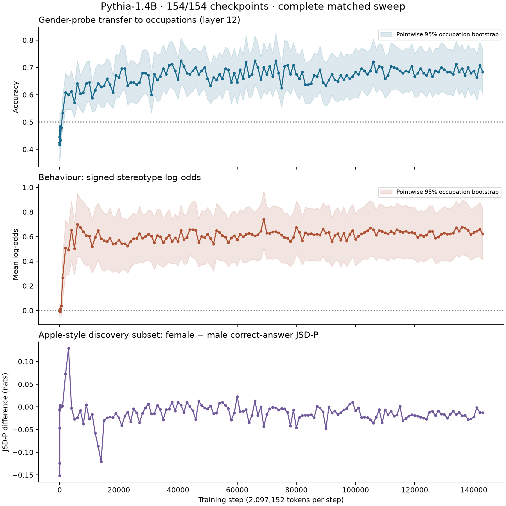

# Representation before behaviour: running report

**Status: complete_matched_sweep. 154/154 matched checkpoints completed.**

behaviour precedes representation under prespecified operational criteria

The Apple paper's reported ~80k transition is for Pythia-6.9B. This experiment studies Pythia-1.4B; its transition is not assumed. The matched occupation task, gender-direction transfer, and Apple-style pronoun-resolution task measure distinct constructs.

| Step | Transfer accuracy | Direct probe accuracy | Signed log-odds | Gender validation |
|---:|---:|---:|---:|---:|
| 0 | 0.425 | 0.524 | -0.006 | 0.425 |
| 1 | 0.425 | 0.524 | -0.006 | 0.425 |
| 2 | 0.425 | 0.524 | -0.006 | 0.433 |
| 4 | 0.417 | 0.524 | -0.006 | 0.433 |
| 8 | 0.446 | 0.518 | -0.003 | 0.458 |
| 16 | 0.425 | 0.501 | 0.006 | 0.425 |
| 32 | 0.454 | 0.508 | 0.000 | 0.392 |
| 64 | 0.471 | 0.503 | -0.011 | 0.450 |
| 128 | 0.483 | 0.511 | -0.010 | 0.517 |
| 256 | 0.433 | 0.528 | 0.013 | 0.525 |
| 512 | 0.479 | 0.482 | 0.037 | 0.517 |
| 1,000 | 0.533 | 0.558 | 0.265 | 1.000 |
| 2,000 | 0.608 | 0.661 | 0.507 | 0.992 |
| 3,000 | 0.600 | 0.633 | 0.491 | 0.983 |
| 4,000 | 0.613 | 0.617 | 0.651 | 1.000 |
| 5,000 | 0.571 | 0.669 | 0.504 | 1.000 |
| 6,000 | 0.642 | 0.654 | 0.699 | 1.000 |
| 7,000 | 0.604 | 0.671 | 0.674 | 0.992 |
| 8,000 | 0.608 | 0.643 | 0.640 | 1.000 |
| 9,000 | 0.642 | 0.638 | 0.608 | 1.000 |
| 10,000 | 0.646 | 0.633 | 0.603 | 1.000 |
| 11,000 | 0.588 | 0.626 | 0.519 | 1.000 |
| 12,000 | 0.617 | 0.643 | 0.594 | 1.000 |
| 13,000 | 0.642 | 0.681 | 0.649 | 0.992 |
| 14,000 | 0.629 | 0.642 | 0.584 | 0.992 |
| 15,000 | 0.633 | 0.643 | 0.567 | 1.000 |
| 16,000 | 0.658 | 0.615 | 0.560 | 0.992 |
| 17,000 | 0.637 | 0.642 | 0.588 | 0.983 |
| 18,000 | 0.608 | 0.644 | 0.540 | 0.950 |
| 19,000 | 0.671 | 0.672 | 0.547 | 0.983 |
| 20,000 | 0.662 | 0.646 | 0.573 | 1.000 |
| 21,000 | 0.696 | 0.649 | 0.542 | 1.000 |
| 22,000 | 0.696 | 0.704 | 0.543 | 1.000 |
| 23,000 | 0.633 | 0.653 | 0.525 | 1.000 |
| 24,000 | 0.646 | 0.686 | 0.563 | 1.000 |
| 25,000 | 0.646 | 0.636 | 0.584 | 1.000 |
| 26,000 | 0.637 | 0.642 | 0.586 | 1.000 |
| 27,000 | 0.646 | 0.649 | 0.624 | 1.000 |
| 28,000 | 0.679 | 0.688 | 0.587 | 0.975 |
| 29,000 | 0.679 | 0.669 | 0.600 | 1.000 |
| 30,000 | 0.671 | 0.699 | 0.619 | 1.000 |
| 31,000 | 0.600 | 0.717 | 0.604 | 1.000 |
| 32,000 | 0.675 | 0.671 | 0.551 | 1.000 |
| 33,000 | 0.654 | 0.708 | 0.609 | 1.000 |
| 34,000 | 0.667 | 0.624 | 0.600 | 0.983 |
| 35,000 | 0.696 | 0.651 | 0.550 | 1.000 |
| 36,000 | 0.675 | 0.633 | 0.585 | 1.000 |
| 37,000 | 0.708 | 0.638 | 0.612 | 1.000 |
| 38,000 | 0.713 | 0.664 | 0.560 | 1.000 |
| 39,000 | 0.688 | 0.678 | 0.590 | 1.000 |
| 40,000 | 0.654 | 0.667 | 0.562 | 1.000 |
| 41,000 | 0.725 | 0.674 | 0.649 | 1.000 |
| 42,000 | 0.704 | 0.650 | 0.575 | 1.000 |
| 43,000 | 0.679 | 0.700 | 0.596 | 1.000 |
| 44,000 | 0.675 | 0.642 | 0.657 | 1.000 |
| 45,000 | 0.688 | 0.699 | 0.656 | 1.000 |
| 46,000 | 0.700 | 0.688 | 0.653 | 1.000 |
| 47,000 | 0.675 | 0.638 | 0.550 | 1.000 |
| 48,000 | 0.688 | 0.661 | 0.601 | 1.000 |
| 49,000 | 0.700 | 0.664 | 0.593 | 1.000 |
| 50,000 | 0.658 | 0.656 | 0.620 | 1.000 |
| 51,000 | 0.633 | 0.668 | 0.586 | 1.000 |
| 52,000 | 0.662 | 0.686 | 0.540 | 1.000 |
| 53,000 | 0.654 | 0.633 | 0.650 | 1.000 |
| 54,000 | 0.675 | 0.650 | 0.633 | 1.000 |
| 55,000 | 0.658 | 0.629 | 0.609 | 1.000 |
| 56,000 | 0.696 | 0.664 | 0.597 | 1.000 |
| 57,000 | 0.692 | 0.633 | 0.551 | 1.000 |
| 58,000 | 0.646 | 0.660 | 0.589 | 1.000 |
| 59,000 | 0.679 | 0.646 | 0.606 | 1.000 |
| 60,000 | 0.646 | 0.672 | 0.574 | 1.000 |
| 61,000 | 0.692 | 0.701 | 0.620 | 1.000 |
| 62,000 | 0.658 | 0.689 | 0.599 | 1.000 |
| 63,000 | 0.721 | 0.692 | 0.617 | 1.000 |
| 64,000 | 0.667 | 0.686 | 0.626 | 1.000 |
| 65,000 | 0.675 | 0.649 | 0.618 | 1.000 |
| 66,000 | 0.725 | 0.633 | 0.606 | 1.000 |
| 67,000 | 0.700 | 0.676 | 0.616 | 1.000 |
| 68,000 | 0.654 | 0.688 | 0.644 | 1.000 |
| 69,000 | 0.700 | 0.701 | 0.740 | 1.000 |
| 70,000 | 0.675 | 0.688 | 0.630 | 1.000 |
| 71,000 | 0.704 | 0.656 | 0.627 | 1.000 |
| 72,000 | 0.667 | 0.657 | 0.637 | 1.000 |
| 73,000 | 0.725 | 0.654 | 0.640 | 1.000 |
| 74,000 | 0.679 | 0.681 | 0.631 | 1.000 |
| 75,000 | 0.625 | 0.625 | 0.613 | 1.000 |
| 76,000 | 0.704 | 0.653 | 0.592 | 1.000 |
| 77,000 | 0.708 | 0.674 | 0.588 | 1.000 |
| 78,000 | 0.675 | 0.622 | 0.559 | 1.000 |
| 79,000 | 0.708 | 0.628 | 0.594 | 1.000 |
| 80,000 | 0.675 | 0.672 | 0.674 | 1.000 |
| 81,000 | 0.658 | 0.651 | 0.636 | 1.000 |
| 82,000 | 0.683 | 0.667 | 0.568 | 1.000 |
| 83,000 | 0.637 | 0.636 | 0.631 | 1.000 |
| 84,000 | 0.637 | 0.685 | 0.620 | 1.000 |
| 85,000 | 0.642 | 0.675 | 0.624 | 1.000 |
| 86,000 | 0.671 | 0.696 | 0.615 | 1.000 |
| 87,000 | 0.667 | 0.649 | 0.620 | 1.000 |
| 88,000 | 0.692 | 0.718 | 0.612 | 1.000 |
| 89,000 | 0.646 | 0.649 | 0.663 | 1.000 |
| 90,000 | 0.633 | 0.647 | 0.629 | 1.000 |
| 91,000 | 0.654 | 0.669 | 0.633 | 1.000 |
| 92,000 | 0.675 | 0.668 | 0.558 | 1.000 |
| 93,000 | 0.654 | 0.671 | 0.609 | 1.000 |
| 94,000 | 0.650 | 0.654 | 0.624 | 1.000 |
| 95,000 | 0.671 | 0.665 | 0.573 | 1.000 |
| 96,000 | 0.654 | 0.668 | 0.628 | 1.000 |
| 97,000 | 0.671 | 0.662 | 0.565 | 1.000 |
| 98,000 | 0.658 | 0.682 | 0.617 | 1.000 |
| 99,000 | 0.667 | 0.683 | 0.650 | 1.000 |
| 100,000 | 0.683 | 0.660 | 0.578 | 1.000 |
| 101,000 | 0.675 | 0.662 | 0.603 | 1.000 |
| 102,000 | 0.696 | 0.711 | 0.622 | 0.992 |
| 103,000 | 0.688 | 0.697 | 0.633 | 1.000 |
| 104,000 | 0.675 | 0.696 | 0.648 | 1.000 |
| 105,000 | 0.688 | 0.710 | 0.669 | 1.000 |
| 106,000 | 0.721 | 0.729 | 0.657 | 1.000 |
| 107,000 | 0.683 | 0.697 | 0.613 | 1.000 |
| 108,000 | 0.704 | 0.683 | 0.650 | 1.000 |
| 109,000 | 0.700 | 0.674 | 0.642 | 1.000 |
| 110,000 | 0.658 | 0.696 | 0.632 | 1.000 |
| 111,000 | 0.671 | 0.701 | 0.623 | 1.000 |
| 112,000 | 0.704 | 0.711 | 0.642 | 1.000 |
| 113,000 | 0.700 | 0.724 | 0.626 | 1.000 |
| 114,000 | 0.696 | 0.707 | 0.658 | 1.000 |
| 115,000 | 0.688 | 0.707 | 0.643 | 1.000 |
| 116,000 | 0.679 | 0.721 | 0.635 | 1.000 |
| 117,000 | 0.688 | 0.707 | 0.644 | 1.000 |
| 118,000 | 0.683 | 0.694 | 0.632 | 1.000 |
| 119,000 | 0.704 | 0.707 | 0.633 | 1.000 |
| 120,000 | 0.667 | 0.683 | 0.628 | 1.000 |
| 121,000 | 0.679 | 0.701 | 0.594 | 1.000 |
| 122,000 | 0.696 | 0.707 | 0.613 | 1.000 |
| 123,000 | 0.679 | 0.701 | 0.602 | 1.000 |
| 124,000 | 0.671 | 0.683 | 0.614 | 1.000 |
| 125,000 | 0.692 | 0.676 | 0.642 | 1.000 |
| 126,000 | 0.667 | 0.696 | 0.642 | 1.000 |
| 127,000 | 0.688 | 0.699 | 0.588 | 1.000 |
| 128,000 | 0.683 | 0.697 | 0.598 | 1.000 |
| 129,000 | 0.700 | 0.688 | 0.619 | 1.000 |
| 130,000 | 0.692 | 0.699 | 0.630 | 1.000 |
| 131,000 | 0.683 | 0.703 | 0.619 | 1.000 |
| 132,000 | 0.683 | 0.693 | 0.623 | 1.000 |
| 133,000 | 0.675 | 0.685 | 0.629 | 1.000 |
| 134,000 | 0.713 | 0.690 | 0.673 | 1.000 |
| 135,000 | 0.683 | 0.704 | 0.646 | 1.000 |
| 136,000 | 0.696 | 0.703 | 0.676 | 1.000 |
| 137,000 | 0.671 | 0.717 | 0.669 | 1.000 |
| 138,000 | 0.700 | 0.689 | 0.652 | 1.000 |
| 139,000 | 0.679 | 0.713 | 0.616 | 1.000 |
| 140,000 | 0.688 | 0.719 | 0.633 | 1.000 |
| 141,000 | 0.662 | 0.700 | 0.645 | 1.000 |
| 142,000 | 0.708 | 0.724 | 0.659 | 1.000 |
| 143,000 | 0.683 | 0.701 | 0.621 | 1.000 |

Primary probe: gender-word-trained linear classifier, tested on occupations with templates held out. Direct occupation-label probe is secondary. Intervals on plots are pointwise, not evidence of an onset; the full-sweep decision uses simultaneous bands, random initialization and label-permutation controls. Read [the protocol](../PROTOCOL.md) for thresholds and limitations.

The Apple curve uses a 128-prompt development discovery subset, not the full paper evaluation. Full reconstruction is separately saved when run. No causality claim follows from decodability. No result establishes that a representation was previously absent.

See `analysis.json`, per-checkpoint `summary.json`, `probes.npz`, `matched/outputs.npz`, and immutable checkpoint provenance for machine-readable evidence.

## Full Apple-style reconstruction

The bracket was selected using the development discovery subset. The table below uses only held-out test sentences.

| Step | Test prompts | Female − male JSD-P gap |
|---:|---:|---:|
| 2,000 | 7,920 | 0.0753 |
| 3,000 | 7,920 | 0.1374 |
| 4,000 | 7,920 | -0.0051 |
| 5,000 | 7,920 | -0.0262 |

Paired test-sentence bootstrap changes are saved in `apple-confirmation.json`. These descriptive intervals do not establish a discontinuity or correct for bracket selection.
