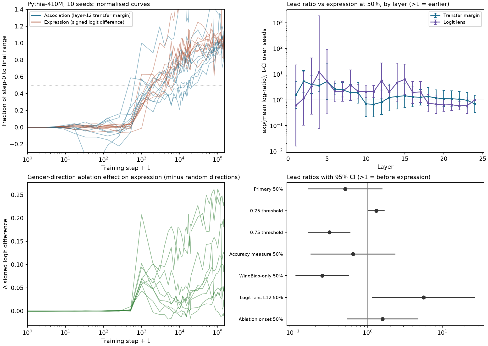

# Protocol v2 results

Preregistered in [PROTOCOL-v2.md](../PROTOCOL-v2.md) (git tag `v2-prereg`). Models loaded: {'pythia-1.4b': 44, 'pythia-410m-seed0': 44, 'pythia-410m-seed1': 44, 'pythia-410m-seed2': 44, 'pythia-410m-seed3': 44, 'pythia-410m-seed4': 44, 'pythia-410m-seed5': 44, 'pythia-410m-seed6': 44, 'pythia-410m-seed7': 44, 'pythia-410m-seed8': 44, 'pythia-410m-seed9': 43}.

Lead ratio r = exp(mean over seeds of log(1+t_expression) - log(1+t_association)). r > 1 means association reaches the threshold first (r times sooner on a log-step clock). Intervals are one-sample t 95% CIs over seeds unless stated.

## Summary

- **Primary result: unresolved.** At the 50% threshold the mean lead ratio is 0.50x (95% CI 0.16 to 1.55, 7 seeds). The point estimate favours expression first, but the interval includes 1. Three seeds were excluded by preregistered rules: seeds 3 and 4 failed the explicit-gender decoding gate at layer 12 (0.64 and 0.63, required 0.8), and seed 9 is missing a checkpoint.
- **The ordering depends on the threshold.** Association reaches 25% of its range first (1.31x, CI 1.03 to 1.66), while expression reaches 75% first (0.31x, CI 0.16 to 0.58). Association starts rising earlier; expression finishes sooner.
- **Ablating the gender direction has a specific effect.** Removing it at layer 12 reduces stereotyped output more than every one of 10 random directions in 9 of 10 seeds, meeting the preregistered criterion. The ablation effect reaches 25% of its range before expression does (1.54x).
- **Layer matters.** The transfer margin leads expression at layers 2 to 7 but not at the primary layer 12. The layer-12 logit lens leads expression (5.61x, CI 1.15 to 27.3). These layer results are descriptive and involve many comparisons.
- **Pythia-1.4B** (one run): no interval excludes 1 at any threshold.
- Secondary results are reported in full below, in the preregistered order. None of them replaces the primary result.

## Primary (confirmatory)

**410M, 10 seeds, combined set, layer-12 signed transfer margin vs expression, 50% threshold:** 0.50x [0.16, 1.55]; n=7; unresolved; excluded seed3 (gender_decoding_0.64), seed4 (gender_decoding_0.63), seed9 (incomplete_grid (43/44))

Per-seed log-ratios: -0.10, +0.79, -2.19, -2.38, -1.11, +0.21, -0.07 (sign consistency 71%).
Hierarchical bootstrap (seeds + occupations) ratio 95% interval: 0.40 to 2.13.

## Secondary (prespecified order)

| Analysis | Result |
|---|---|
| 1. Threshold 25% | 1.31x [1.03, 1.66]; n=7; association first; excluded seed3 (gender_decoding_0.64), seed4 (gender_decoding_0.63), seed9 (incomplete_grid (43/44)) |
| 1. Threshold 75% | 0.31x [0.16, 0.58]; n=7; expression first; excluded seed3 (gender_decoding_0.64), seed4 (gender_decoding_0.63), seed9 (incomplete_grid (43/44)) |
| 2. Transfer accuracy, 25% | 1.14x [0.71, 1.83]; n=7; unresolved; excluded seed3 (gender_decoding_0.64), seed4 (gender_decoding_0.63), seed9 (incomplete_grid (43/44)) |
| 2. Transfer accuracy, 50% | 0.63x [0.17, 2.32]; n=7; unresolved; excluded seed3 (gender_decoding_0.64), seed4 (gender_decoding_0.63), seed9 (incomplete_grid (43/44)) |
| 2. Transfer accuracy, 75% | 0.77x [0.32, 1.83]; n=7; unresolved; excluded seed3 (gender_decoding_0.64), seed4 (gender_decoding_0.63), seed9 (incomplete_grid (43/44)) |
| 3. WinoBias-only, 25% | 1.15x [0.42, 3.13]; n=7; unresolved; excluded seed3 (gender_decoding_0.64), seed4 (gender_decoding_0.63), seed9 (incomplete_grid (43/44)) |
| 3. WinoBias-only, 50% | 0.25x [0.11, 0.55]; n=7; expression first; excluded seed3 (gender_decoding_0.64), seed4 (gender_decoding_0.63), seed9 (incomplete_grid (43/44)) |
| 3. WinoBias-only, 75% | 0.23x [0.10, 0.53]; n=7; expression first; excluded seed3 (gender_decoding_0.64), seed4 (gender_decoding_0.63), seed9 (incomplete_grid (43/44)) |
| 5. Pythia-1.4B combined:0.25 (occupation bootstrap) | ratio 1.38x [0.96, 2.59] |
| 5. Pythia-1.4B combined:0.5 (occupation bootstrap) | ratio 1.46x [0.63, 4.49] |
| 5. Pythia-1.4B combined:0.75 (occupation bootstrap) | ratio 0.45x [0.28, 1.71] |
| 5. Pythia-1.4B winobias:0.25 (occupation bootstrap) | ratio 0.94x [0.70, 2.12] |
| 5. Pythia-1.4B winobias:0.5 (occupation bootstrap) | ratio 1.14x [0.61, 1.82] |
| 5. Pythia-1.4B winobias:0.75 (occupation bootstrap) | ratio 0.53x [0.34, 1.91] |
| 7. Logit lens layer 12 vs expression, 50% | 5.61x [1.15, 27.27]; n=8; association first; excluded seed2 (nonpositive_endpoint_range), seed9 (incomplete_grid (43/44)) |
| 8. Ablation-effect onset, 25% | 1.54x [1.25, 1.89]; n=8; association first; excluded seed3 (nonpositive_endpoint_range), seed9 (incomplete_grid (43/44)) |
| 8. Ablation-effect onset, 50% | 1.58x [0.53, 4.70]; n=8; unresolved; excluded seed3 (nonpositive_endpoint_range), seed9 (incomplete_grid (43/44)) |
| 8. Ablation-effect onset, 75% | 2.68x [0.53, 13.50]; n=8; unresolved; excluded seed3 (nonpositive_endpoint_range), seed9 (incomplete_grid (43/44)) |
| 8. Ablation specificity at 143k | gender direction beats all 10 random directions in 9/10 seeds (criterion at least 8: met); mean excess effect 0.097 logits [0.037, 0.157] |
| 9. Selectivity onset, 25% | 1.44x [1.12, 1.85]; n=9; association first; excluded seed9 (incomplete_grid (43/44)) |
| 9. Selectivity onset, 50% | 2.21x [1.09, 4.48]; n=9; association first; excluded seed9 (incomplete_grid (43/44)) |
| 9. Selectivity onset, 75% | 1.81x [0.80, 4.07]; n=9; unresolved; excluded seed9 (incomplete_grid (43/44)) |

### 6 and 7. Layer profile (50% threshold, descriptive; no layer is selected)

| Layer | Transfer margin | Logit lens |
|---:|---|---|
| 0 | n=0; inconclusive too many exclusions; excluded seed0 (nonpositive_endpoint_range), seed1 (nonpositive_endpoint_range), seed2 (nonpositive_endpoint_range), seed3 (nonpositive_endpoint_range), seed4 (nonpositive_endpoint_range), seed5 (nonpositive_endpoint_range), seed6 (nonpositive_endpoint_range), seed7 (nonpositive_endpoint_range), seed8 (nonpositive_endpoint_range), seed9 (incomplete_grid (43/44)) | n=0; inconclusive too many exclusions; excluded seed0 (nonpositive_endpoint_range), seed1 (nonpositive_endpoint_range), seed2 (nonpositive_endpoint_range), seed3 (nonpositive_endpoint_range), seed4 (nonpositive_endpoint_range), seed5 (nonpositive_endpoint_range), seed6 (nonpositive_endpoint_range), seed7 (nonpositive_endpoint_range), seed8 (nonpositive_endpoint_range), seed9 (incomplete_grid (43/44)) |
| 1 | 1.52x [0.46, 5.03]; n=8; unresolved; excluded seed4 (nonpositive_endpoint_range), seed9 (incomplete_grid (43/44)) | 0.60x [0.02, 22.82]; n=4; inconclusive too many exclusions; excluded seed0 (nonpositive_endpoint_range), seed5 (nonpositive_endpoint_range), seed6 (nonpositive_endpoint_range), seed7 (nonpositive_endpoint_range), seed8 (nonpositive_endpoint_range), seed9 (incomplete_grid (43/44)) |
| 2 | 5.25x [1.97, 14.03]; n=8; association first; excluded seed5 (nonpositive_endpoint_range), seed9 (incomplete_grid (43/44)) | 1.12x [0.10, 12.17]; n=5; inconclusive too many exclusions; excluded seed2 (nonpositive_endpoint_range), seed5 (nonpositive_endpoint_range), seed6 (nonpositive_endpoint_range), seed8 (nonpositive_endpoint_range), seed9 (incomplete_grid (43/44)) |
| 3 | 3.93x [1.72, 8.97]; n=8; association first; excluded seed5 (nonpositive_endpoint_range), seed9 (incomplete_grid (43/44)) | 3.39x [0.27, 42.34]; n=5; inconclusive too many exclusions; excluded seed0 (nonpositive_endpoint_range), seed2 (nonpositive_endpoint_range), seed5 (nonpositive_endpoint_range), seed6 (nonpositive_endpoint_range), seed9 (incomplete_grid (43/44)) |
| 4 | 3.59x [2.06, 6.25]; n=9; association first; excluded seed9 (incomplete_grid (43/44)) | 11.96x [0.08, 1835.41]; n=3; inconclusive too many exclusions; excluded seed0 (nonpositive_endpoint_range), seed2 (nonpositive_endpoint_range), seed5 (nonpositive_endpoint_range), seed6 (nonpositive_endpoint_range), seed7 (nonpositive_endpoint_range), seed8 (nonpositive_endpoint_range), seed9 (incomplete_grid (43/44)) |
| 5 | 5.16x [1.01, 26.43]; n=9; association first; excluded seed9 (incomplete_grid (43/44)) | 5.28x [0.30, 92.57]; n=5; inconclusive too many exclusions; excluded seed0 (nonpositive_endpoint_range), seed2 (nonpositive_endpoint_range), seed6 (nonpositive_endpoint_range), seed8 (nonpositive_endpoint_range), seed9 (incomplete_grid (43/44)) |
| 6 | 2.61x [1.56, 4.36]; n=9; association first; excluded seed9 (incomplete_grid (43/44)) | 2.15x [0.84, 5.46]; n=5; inconclusive too many exclusions; excluded seed0 (nonpositive_endpoint_range), seed2 (nonpositive_endpoint_range), seed6 (nonpositive_endpoint_range), seed8 (nonpositive_endpoint_range), seed9 (incomplete_grid (43/44)) |
| 7 | 2.43x [1.28, 4.62]; n=9; association first; excluded seed9 (incomplete_grid (43/44)) | 2.14x [0.88, 5.21]; n=5; inconclusive too many exclusions; excluded seed0 (nonpositive_endpoint_range), seed2 (nonpositive_endpoint_range), seed6 (nonpositive_endpoint_range), seed8 (nonpositive_endpoint_range), seed9 (incomplete_grid (43/44)) |
| 8 | 1.93x [0.93, 3.99]; n=9; unresolved; excluded seed9 (incomplete_grid (43/44)) | 3.72x [0.96, 14.48]; n=7; unresolved; excluded seed6 (nonpositive_endpoint_range), seed8 (nonpositive_endpoint_range), seed9 (incomplete_grid (43/44)) |
| 9 | 1.88x [0.74, 4.78]; n=9; unresolved; excluded seed9 (incomplete_grid (43/44)) | 2.14x [1.15, 3.98]; n=6; inconclusive too many exclusions; excluded seed2 (nonpositive_endpoint_range), seed6 (nonpositive_endpoint_range), seed8 (nonpositive_endpoint_range), seed9 (incomplete_grid (43/44)) |
| 10 | 0.69x [0.23, 2.10]; n=9; unresolved; excluded seed9 (incomplete_grid (43/44)) | 2.07x [1.21, 3.53]; n=6; inconclusive too many exclusions; excluded seed2 (nonpositive_endpoint_range), seed6 (nonpositive_endpoint_range), seed8 (nonpositive_endpoint_range), seed9 (incomplete_grid (43/44)) |
| 11 | 0.67x [0.22, 2.05]; n=9; unresolved; excluded seed9 (incomplete_grid (43/44)) | 2.08x [1.21, 3.59]; n=6; inconclusive too many exclusions; excluded seed2 (nonpositive_endpoint_range), seed6 (nonpositive_endpoint_range), seed8 (nonpositive_endpoint_range), seed9 (incomplete_grid (43/44)) |
| 12 | 0.80x [0.27, 2.41]; n=9; unresolved; excluded seed9 (incomplete_grid (43/44)) | 5.61x [1.15, 27.27]; n=8; association first; excluded seed2 (nonpositive_endpoint_range), seed9 (incomplete_grid (43/44)) |
| 13 | 1.23x [0.37, 4.06]; n=9; unresolved; excluded seed9 (incomplete_grid (43/44)) | 1.97x [1.10, 3.54]; n=6; inconclusive too many exclusions; excluded seed0 (nonpositive_endpoint_range), seed3 (nonpositive_endpoint_range), seed6 (nonpositive_endpoint_range), seed9 (incomplete_grid (43/44)) |
| 14 | 1.34x [0.44, 4.10]; n=9; unresolved; excluded seed9 (incomplete_grid (43/44)) | 4.70x [0.83, 26.68]; n=6; inconclusive too many exclusions; excluded seed1 (nonpositive_endpoint_range), seed2 (nonpositive_endpoint_range), seed6 (nonpositive_endpoint_range), seed9 (incomplete_grid (43/44)) |
| 15 | 1.44x [0.50, 4.14]; n=9; unresolved; excluded seed9 (incomplete_grid (43/44)) | 6.25x [1.60, 24.38]; n=7; association first; excluded seed0 (nonpositive_endpoint_range), seed2 (nonpositive_endpoint_range), seed9 (incomplete_grid (43/44)) |
| 16 | 1.29x [0.53, 3.13]; n=9; unresolved; excluded seed9 (incomplete_grid (43/44)) | 1.95x [0.73, 5.23]; n=8; unresolved; excluded seed0 (nonpositive_endpoint_range), seed9 (incomplete_grid (43/44)) |
| 17 | 1.25x [0.62, 2.51]; n=9; unresolved; excluded seed9 (incomplete_grid (43/44)) | 2.01x [0.79, 5.14]; n=8; unresolved; excluded seed0 (nonpositive_endpoint_range), seed9 (incomplete_grid (43/44)) |
| 18 | 1.34x [0.60, 3.01]; n=9; unresolved; excluded seed9 (incomplete_grid (43/44)) | 0.74x [0.34, 1.61]; n=9; unresolved; excluded seed9 (incomplete_grid (43/44)) |
| 19 | 1.18x [0.57, 2.43]; n=9; unresolved; excluded seed9 (incomplete_grid (43/44)) | 0.67x [0.30, 1.52]; n=9; unresolved; excluded seed9 (incomplete_grid (43/44)) |
| 20 | 1.12x [0.54, 2.30]; n=9; unresolved; excluded seed9 (incomplete_grid (43/44)) | 0.63x [0.35, 1.12]; n=9; unresolved; excluded seed9 (incomplete_grid (43/44)) |
| 21 | 1.09x [0.53, 2.25]; n=9; unresolved; excluded seed9 (incomplete_grid (43/44)) | 0.64x [0.39, 1.07]; n=9; unresolved; excluded seed9 (incomplete_grid (43/44)) |
| 22 | 1.05x [0.53, 2.09]; n=9; unresolved; excluded seed9 (incomplete_grid (43/44)) | 0.58x [0.40, 0.84]; n=9; expression first; excluded seed9 (incomplete_grid (43/44)) |
| 23 | 0.96x [0.48, 1.92]; n=9; unresolved; excluded seed9 (incomplete_grid (43/44)) | 0.59x [0.29, 1.19]; n=9; unresolved; excluded seed9 (incomplete_grid (43/44)) |
| 24 | 0.69x [0.32, 1.48]; n=9; unresolved; excluded seed9 (incomplete_grid (43/44)) | 1.00x [1.00, 1.00]; n=9; unresolved; excluded seed9 (incomplete_grid (43/44)) |

### 10. Continuity with v1 (WinoBias set, transfer accuracy; descriptive only)

| Model | Threshold | Association | Expression | Bracket rule | Observed-grid lead CI |
|---|---:|---|---|---|---|
| pythia-410m-seed0 | 25% | [256, 512] | [1000, 2000] | association_before_expression | [-4000.0, 1992.0] |
| pythia-410m-seed0 | 50% | [2000, 3000] | [1000, 2000] | overlapping_brackets | [-4000.0, 1968.0] |
| pythia-410m-seed0 | 75% | [5000, 6000] | [1000, 2000] | expression_before_association | [-9000.0, 2000.0] |
| pythia-410m-seed1 | 25% | [4000, 5000] | [512, 1000] | expression_before_association | [-5000.0, 1992.0] |
| pythia-410m-seed1 | 50% | [4000, 5000] | [1000, 2000] | expression_before_association | [-5000.0, 1992.0] |
| pythia-410m-seed1 | 75% | [5000, 6000] | [4000, 5000] | overlapping_brackets | [-5000.0, 2968.0] |
| pythia-410m-seed2 | 25% | [64, 128] | [1000, 2000] | association_before_expression | [0.0, 1984.0] |
| pythia-410m-seed2 | 50% | [3000, 4000] | [1000, 2000] | expression_before_association | [-8000.0, 2872.0] |
| pythia-410m-seed2 | 75% | [18000, 19000] | [1000, 2000] | expression_before_association | [-36099.99999999999, 3000.0] |
| pythia-410m-seed3 | 25% | [128, 256] | [512, 1000] | association_before_expression | [0.0, 2872.0] |
| pythia-410m-seed3 | 50% | [256, 512] | [1000, 2000] | association_before_expression | [0.0, 3872.0] |
| pythia-410m-seed3 | 75% | [1000, 2000] | [3000, 4000] | association_before_expression | [0.0, 6488.0] |
| pythia-410m-seed4 | 25% | [2, 4] | [512, 1000] | association_before_expression | [504.0, 1996.0] |
| pythia-410m-seed4 | 50% | [4, 8] | [1000, 2000] | association_before_expression | [872.0, 1996.0] |
| pythia-410m-seed4 | 75% | [4, 8] | [1000, 2000] | association_before_expression | [992.0, 2992.0] |
| pythia-410m-seed5 | 25% | [2000, 3000] | [512, 1000] | expression_before_association | [-18000.0, 1968.0] |
| pythia-410m-seed5 | 50% | [17000, 18000] | [1000, 2000] | expression_before_association | [-78000.0, 1000.0] |
| pythia-410m-seed5 | 75% | [70000, 80000] | [3000, 4000] | expression_before_association | [-88000.0, -9000.0] |
| pythia-410m-seed6 | 25% | [2000, 3000] | [1000, 2000] | overlapping_brackets | [-2000.0, 1992.0] |
| pythia-410m-seed6 | 50% | [2000, 3000] | [1000, 2000] | overlapping_brackets | [-2000.0, 2000.0] |
| pythia-410m-seed6 | 75% | [2000, 3000] | [8000, 9000] | association_before_expression | [-6000.0, 10000.0] |
| pythia-410m-seed7 | 25% | [32, 64] | [1000, 2000] | association_before_expression | [-1000.0, 1968.0] |
| pythia-410m-seed7 | 50% | [2000, 3000] | [1000, 2000] | overlapping_brackets | [-3000.0, 1936.0] |
| pythia-410m-seed7 | 75% | [6000, 7000] | [1000, 2000] | expression_before_association | [-12000.0, 2000.0] |
| pythia-410m-seed8 | 25% | [32, 64] | [512, 1000] | association_before_expression | [-3000.0, 996.0] |
| pythia-410m-seed8 | 50% | [2000, 3000] | [512, 1000] | expression_before_association | [-6000.0, 1968.0] |
| pythia-410m-seed8 | 75% | [4000, 5000] | [3000, 4000] | overlapping_brackets | [-10000.0, 4000.0] |
| pythia-1.4b | 25% | [512, 1000] | [512, 1000] | overlapping_brackets | [-1000.0, 1872.0] |
| pythia-1.4b | 50% | [1000, 2000] | [1000, 2000] | overlapping_brackets | [-2000.0, 1000.0] |
| pythia-1.4b | 75% | [5000, 6000] | [1000, 2000] | expression_before_association | [-7024.999999999998, 2000.0] |

## Deviations and notes

- `EleutherAI/pythia-410m-seed9` has no weights on its `step40000` branch (only tokenizer files), so that checkpoint could not be run. As preregistered, seed 9 is excluded from analyses that need the full grid. A post-hoc sensitivity analysis that keeps seed 9 on its remaining 43 steps gives the same conclusions (25%: 1.29x, CI 1.05 to 1.58; 50%: 0.54x, CI 0.20 to 1.40; 75%: 0.35x, CI 0.19 to 0.64). See `v2-sensitivity-seed9.json`.
- The two smoke-test checkpoints (seed 1 and 1.4B at step 143,000) record protocol commit `c951ae6`; all others record `2303e75`. The only difference between those commits is the analysis code and a runner check, not the measurement code.
- On synthetic data with a known 1.5x lead, the interpolated crossing estimator recovered 1.41x to 1.56x, so it can shrink ratios slightly toward 1.
- The logit lens and ablation curves are noisier than the primary measures, and several seeds are excluded from them for nonpositive endpoint ranges.
